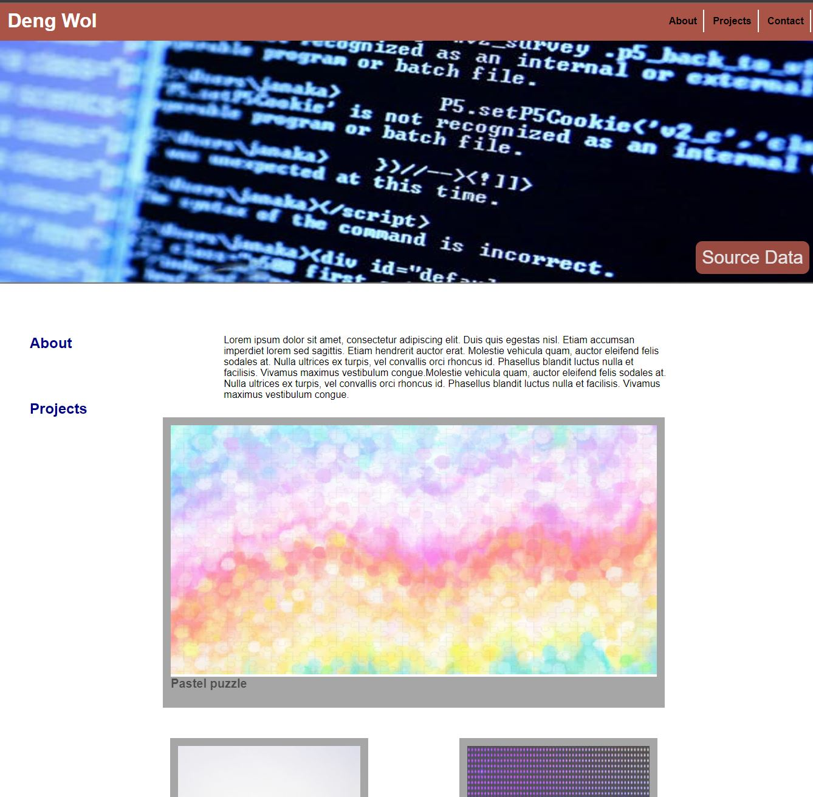

# Master-Portfolio

Within the contents of this Master Portfolio contains the projects written by Deng Wol to display an example of my portfolio to 
prospective employers.

The website is live https://raiville.github.io/HomeWork_Week1/
This work can be downloaded by doing a git clone https://github.com/raiville/Master-Portfolio.git in terminal
This work can also be viewed on https://raiville.github.io/Master-Portfolio/

Or 

Using the SSH keys pasted below
git@github.com:raiville/Master-Portfolio.git

Or

Using the git CLI pasted below
gh repo clone raiville/Master-Portfolio 

